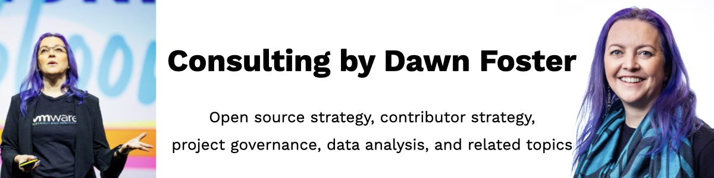

# Consulting by Dawn Foster

Leverage Dawn Foster's decades of experience working in open source to help companies make the most out of their open source efforts by engaging her <a href="https://fastwonder.com/">consulting services</a>. Dawn has worked in open source leadership roles at very large hardware and software companies (Intel and VMware) in addition to startups and mid-sized companies.</td> 

Learn more:

* [Consulting](https://fastwonder.com/)
* [Blog](https://fastwonderblog.com/)
* [Speaking Engagements](https://fastwonderblog.com/speaking/)
* [Dawn Foster on LinkedIn](https://www.linkedin.com/in/dawnfoster/)
